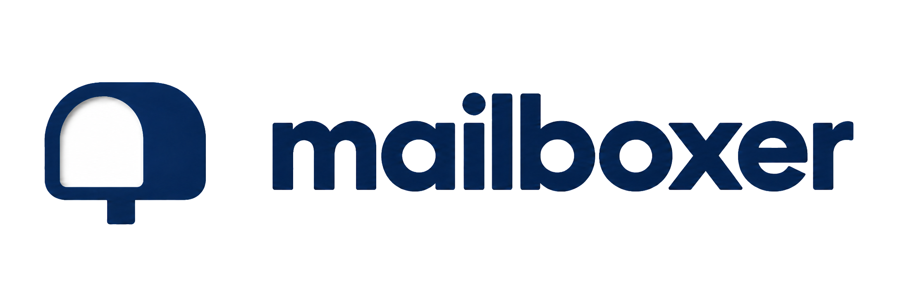

# mailboxer

mailboxer connects your email, calendars, contacts, and reminders to any agent through an always-on MCP. It is designed for people who want to use their own accounts without deploying and configuring several separate services. iCloud works out of the box, and mailboxer automatically discovers standard IMAP, SMTP, CalDAV, and CardDAV settings for other providers when available.

Each MCP connection authorizes one account. To connect personal and work accounts, add this same `/mcp` URL under separate connection names and sign in to each account independently. Tools always use the account authorized for their connection; `get_account` returns its identity and available services.

For Pi's built-in MCP support:

```bash
pi mcp add mailboxer-personal --url https://YOUR-WORKER/mcp
pi mcp login mailboxer-personal
pi mcp add mailboxer-work --url https://YOUR-WORKER/mcp
pi mcp login mailboxer-work
```

Pi stores separate OAuth credentials for each name and URL. For other clients, create separate connections to the same endpoint using their connection settings.

**Upgrading from multi-account support:** existing OAuth connections must reconnect. Sign in to each account separately; saved credentials remain available during sign-in, but sibling accounts are never included in the new connection. Existing vault records are retained for reconnecting remaining accounts. `list_accounts` is replaced by `get_account`, and resource tools no longer accept `accountId`. Register separate connections for any workflows that previously selected several accounts.

## Deploy it yourself

Deploy mailboxer to your own Cloudflare account with the button below. Cloudflare provisions the Worker and its private storage; you only need to provide a unique encryption secret. Email credentials are added later through mailboxer’s sign-in page and are never committed to the repository.

[](https://deploy.workers.cloudflare.com/?url=https://github.com/mailboxer-dev/mailboxer)

### Upgrading your installation

The [Deploy to Cloudflare button documentation](https://developers.cloudflare.com/workers/platform/deploy-buttons/) explains how the button creates a user-owned repository and connects it to Cloudflare. That repository is the source of truth for your installation. Sync updates from `mailboxer-dev/mailboxer`, review them, and update the production branch; the existing [Cloudflare Workers Builds](https://developers.cloudflare.com/workers/ci-cd/builds/) integration then builds and deploys the Worker.

The examples below assume that the installation repository and its production branch are named `main`. Replace `main` if you use a different production branch.

#### Manual upgrade

Clone the repository created for your installation, add the upstream repository, merge its `main` branch, run the checks, and push the result:

```sh
git clone https://github.com/<YOUR_GITHUB_USERNAME>/<YOUR_INSTALLATION_REPOSITORY>.git
cd <YOUR_INSTALLATION_REPOSITORY>
git remote add upstream https://github.com/mailboxer-dev/mailboxer.git
git fetch upstream main
git switch main
git pull --ff-only origin main
git merge --no-edit upstream/main

npm ci
npm run type-check
npm run lint
npm test

git push origin main
```

If you already have an `upstream` remote, update it with `git remote set-url upstream https://github.com/mailboxer-dev/mailboxer.git` instead of adding it. A merge conflict or failed check is a stop point: resolve the conflict or fix the check, rerun the checks, and only then push. Use `git merge --abort` to abandon an in-progress merge. If your repository requires pull requests, push the merge to a topic branch and merge that pull request into `main` instead.

When resolving conflicts, preserve the values generated for your installation in `wrangler.jsonc`, especially the Worker `name`, KV namespace IDs under `kv_namespaces`, and any account- or environment-specific settings. Do not replace those values with the upstream defaults. Never commit `MAIL_CREDENTIALS_ENCRYPTION_KEY`, `.dev.vars`, other runtime secrets, or mailbox credentials; keep the encryption key in the Worker's Cloudflare secret configuration and manage mailbox credentials through mailboxer's sign-in flow.

#### Automated weekly upgrades with GitHub Actions

For a GitHub installation repository, save the following as `.github/workflows/sync-upstream.yml`. It runs every Monday at 06:00 UTC and can also be started with **Run workflow**. The dedicated `upstream-sync` branch is recreated from the latest `main`, so an existing open pull request is updated rather than duplicated. The workflow runs the same repository checks before pushing that branch and opening a review pull request.

```yaml
name: Sync mailboxer upstream

on:
  schedule:
    - cron: "0 6 * * 1"
  workflow_dispatch:

permissions:
  contents: read

concurrency:
  group: mailboxer-upstream-sync
  cancel-in-progress: false

jobs:
  validate:
    runs-on: ubuntu-latest
    outputs:
      has_changes: ${{ steps.merge.outputs.has_changes }}
      upstream_sha: ${{ steps.merge.outputs.upstream_sha }}
    steps:
      - name: Check out installation repository
        uses: actions/checkout@v6
        with:
          fetch-depth: 0
          persist-credentials: false

      - name: Fetch upstream
        run: |
          git remote add upstream https://github.com/mailboxer-dev/mailboxer.git
          git fetch --no-tags upstream main
          git fetch --no-tags origin main

      - name: Merge upstream into sync branch
        id: merge
        run: |
          git config user.name "github-actions[bot]"
          git config user.email "41898282+github-actions[bot]@users.noreply.github.com"
          git switch -C upstream-sync origin/main
          git merge --no-edit upstream/main
          echo "upstream_sha=$(git rev-parse upstream/main)" >> "$GITHUB_OUTPUT"
          if git diff --quiet origin/main...HEAD; then
            echo "has_changes=false" >> "$GITHUB_OUTPUT"
          else
            echo "has_changes=true" >> "$GITHUB_OUTPUT"
          fi

      - name: Install dependencies
        if: steps.merge.outputs.has_changes == 'true'
        run: npm ci

      - name: Type-check
        if: steps.merge.outputs.has_changes == 'true'
        run: npm run type-check

      - name: Lint
        if: steps.merge.outputs.has_changes == 'true'
        run: npm run lint

      - name: Test
        if: steps.merge.outputs.has_changes == 'true'
        run: npm test

  publish:
    needs: validate
    if: needs.validate.outputs.has_changes == 'true'
    runs-on: ubuntu-latest
    permissions:
      contents: write
      pull-requests: write
    steps:
      - name: Check out installation repository
        uses: actions/checkout@v6
        with:
          fetch-depth: 0

      - name: Fetch validated upstream revision
        run: |
          git remote add upstream https://github.com/mailboxer-dev/mailboxer.git
          git fetch --no-tags upstream "${{ needs.validate.outputs.upstream_sha }}"
          git fetch --no-tags origin main
          if git ls-remote --exit-code --heads origin upstream-sync >/dev/null 2>&1; then
            git fetch --no-tags origin upstream-sync
          fi

      - name: Recreate validated sync branch
        run: |
          git config user.name "github-actions[bot]"
          git config user.email "41898282+github-actions[bot]@users.noreply.github.com"
          git switch -C upstream-sync origin/main
          git merge --no-edit "${{ needs.validate.outputs.upstream_sha }}"

      - name: Push sync branch
        run: git push --force-with-lease --set-upstream origin upstream-sync

      - name: Create or update pull request
        env:
          GH_TOKEN: ${{ github.token }}
        run: |
          if [ "$(gh pr list --base main --head upstream-sync --state open --json number --jq 'length')" -eq 0 ]; then
            gh pr create \
              --base main \
              --head upstream-sync \
              --title "chore: sync with mailboxer upstream" \
              --body "Review upstream changes before merging. Merging into main triggers the existing Cloudflare Workers Build."
          else
            echo "An open upstream sync pull request already exists; the branch was updated."
          fi
```

The validation job is read-only and does not persist GitHub credentials while it installs or executes upstream code. Only after that job passes does a fresh publishing job receive `contents: write` and `pull-requests: write`, merge the exact upstream commit that was validated, and update the pull request. In the installation repository, go to **Settings > Actions > General > Workflow permissions** and enable **Allow GitHub Actions to create and approve pull requests**; an organization policy may prevent changing this setting. The workflow uses only the automatically provided `GITHUB_TOKEN`; it does not need a Cloudflare API token, account credentials, or mailbox secrets, and it never deploys directly. Merging the reviewed pull request into `main` is what triggers the Workers Build. If there are no upstream changes, the workflow exits without pushing a branch or creating a pull request. If the upstream merge conflicts or any check fails, the workflow stops before updating the sync branch or pull request, leaving the update for manual resolution.

## Technical overview

mailboxer is a stateless TypeScript Cloudflare Worker with a bundled OAuth server and MCP endpoint. It stores OAuth records and encrypted account settings in Cloudflare KV, while messages, searches, calendars, and contacts are always fetched live from IMAP, SMTP, CalDAV, or CardDAV. It uses no database, mailbox cache, search index, Durable Object, or persistent protocol connection.
